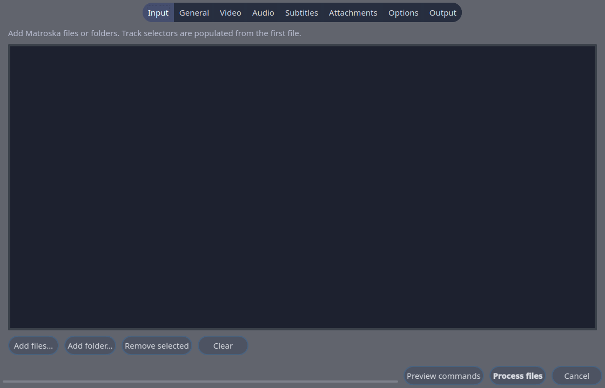

# JMkvpropedit Qt

<p align="center">
  
</p>

A native Qt 6 batch interface for `mkvpropedit`, initially targeted at KDE
Plasma 6 on Bazzite. It is a clean Qt Widgets port of Bruno Barbieri's archived
JMkvpropedit workflow and retains the original BSD-2-Clause notice.

> **Preview status:** this repository is private while the application is
> tested and made portable across more Linux distributions. Back up important
> media before testing: `mkvpropedit` edits Matroska files in place.



## Current features

- Batch file input, drag-and-drop, and recursive folder import
- Reliable JSON track discovery through `mkvmerge -J`
- Segment title, chapters, tags, and additional arguments
- Video/audio/subtitle enabled, default, forced, name, and language edits
- Add attachments with automatic MIME-type detection
- Safely separated process arguments and complete command preview
- Sequential batch processing, progress, cancellation, and per-file output
- System/Kvantum, forced dark, and forced light appearance modes
- Native Wayland support and KWin blur request through KF6 WindowSystem

## Requirements

- Qt 6.6 or newer with Qt Widgets
- KF6 WindowSystem (optional at build time, recommended for KWin blur)
- MKVToolNix (`mkvpropedit` and `mkvmerge`)
- CMake 3.22 or newer and a C++20 compiler

## Build on Bazzite

The current development environment uses a Fedora Distrobox so the immutable
Bazzite base remains unchanged:

```sh
distrobox enter mkv-qt6
cmake -S . -B build -G Ninja \
  -DCMAKE_BUILD_TYPE=Release \
  -DCMAKE_INSTALL_PREFIX=/usr
cmake --build build
./build/jmkvpropedit-qt
```

## Packaging strategy

The initial AppImage is intentionally Bazzite-focused. It uses the host's
matching Qt 6/KF6 and Kvantum plugin, ensuring native Plasma integration and
avoiding mismatched Wayland libraries. A future distributable AppImage will be
built against an older stable runtime and tested across multiple distributions.

## Known preview limitations

- Attachment replacement and deletion are not implemented yet.
- The original application's automatic numbering templates are not implemented.
- The current AppImage targets the developer's Bazzite system rather than
  unrelated Linux distributions.

## License and attribution

BSD-2-Clause. The original JMkvpropedit copyright notice by Bruno Barbieri is
retained in [LICENSE](LICENSE). This project is an independent port and is not
part of MKVToolNix.
